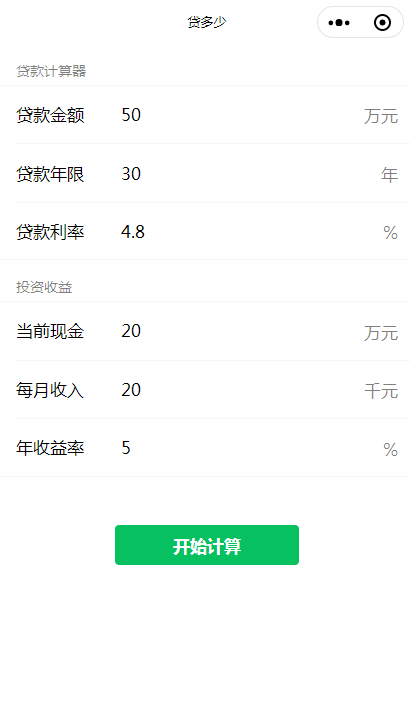

# 贷款计算器 

一款用于计算贷款的微信小程序 - 贷多少。

想法来源于目前的贷款计算器只紧考虑贷款金额，然后根据年限和利率推算还款利息，并没有根据个人未来的收入和年收益率，推荐给用户最好的贷款金额数。

该小程序的目的是通过考虑更多未来因素，给贷款用户更好的贷款金额建议，避免被推销员“能贷多少就贷多少，货币一定会贬值的言论” 等缺乏实际计算结果的言论所影响。

目前只在微信体验版，欢迎联系参与体验和提供建议。

### 界面预览
